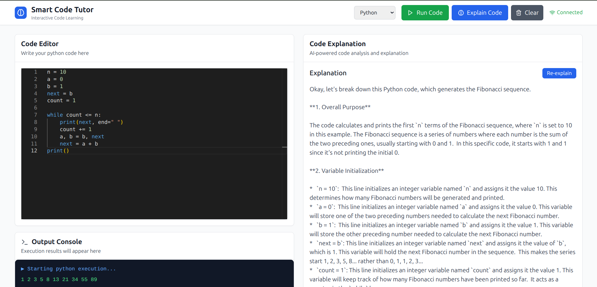

# Smart Code Tutor

An interactive code interpreter with AI-powered explanations, featuring real-time code execution and educational insights powered by Google's Gemini AI.



## Features

- 🚀 **Real-time Code Execution**: Secure code execution using E2B sandboxes
- 🧠 **AI-Powered Explanations**: Get detailed explanations of your code using Gemini AI
- 🌐 **WebSocket Integration**: Real-time streaming of execution results and explanations
- 💻 **Multi-language Support**: Python and JavaScript execution
- 🎨 **Modern UI**: Beautiful React interface with Monaco editor
- 🔒 **Secure**: Sandboxed execution environment with fallback modes

## Quick Start

### Prerequisites

- **Python 3.8+** - [Download Python](https://python.org/downloads/)
- **Node.js 16+** - [Download Node.js](https://nodejs.org/)
- **pnpm** - Will be installed automatically if not present

### Installation

#### Linux/macOS

```bash
# Clone the repository
git clone <your-repo-url>
cd Smart-Code-Tutor

# Run the setup script (installs everything)
./setup.sh

# Start the application
./setup.sh start
```

#### Windows

```batch
# Clone the repository
git clone <your-repo-url>
cd Smart-Code-Tutor

# Run the setup script (installs everything)
setup.bat

# Start the application
setup.bat start
```

### Manual Setup

If you prefer manual setup:

```bash
# Install root dependencies
pnpm install

# Setup backend
cd backend
python3 -m venv venv
source venv/bin/activate  # On Windows: venv\Scripts\activate
pip install -r requirements-minimal.txt
cp .env.example .env
cd ..

# Setup frontend
cd frontend
pnpm install
cd ..

# Start both services
pnpm dev
```

## Configuration

### Environment Variables

Copy `backend/.env.example` to `backend/.env` and configure:

```env
# Google Gemini API Key (for AI explanations)
GOOGLE_API_KEY=your_gemini_api_key_here

# E2B API Key (for secure code execution)
E2B_API_KEY=your_e2b_api_key_here

# Application settings
APP_HOST=0.0.0.0
APP_PORT=8000
DEBUG=True
```

### API Keys

1. **Google Gemini API**: Get your key from [Google AI Studio](https://makersuite.google.com/app/apikey)
2. **E2B API**: Get your key from [E2B Dashboard](https://e2b.dev/dashboard)

**Note**: The application works without API keys but with limited functionality:

- Without Gemini API: Basic explanations only
- Without E2B API: Local fallback execution (less secure)

## Usage

1. **Start the application**:

   ```bash
   ./setup.sh start  # Linux/macOS
   setup.bat start   # Windows
   ```

2. **Access the interface**:

   - Frontend: http://localhost:3000
   - Backend API: http://localhost:8000
   - API Documentation: http://localhost:8000/docs

3. **Write and execute code**:
   - Choose your language (Python/JavaScript)
   - Write code in the Monaco editor
   - Click "Run Code" to execute
   - Click "Explain Code" for AI-powered explanations

## Architecture

```
Smart-Code-Tutor/
├── backend/                 # FastAPI backend
│   ├── services/           # Core services
│   │   ├── code_executor.py    # Code execution with E2B
│   │   ├── rag_service.py      # AI explanations with Gemini
│   │   └── websocket_manager.py # WebSocket connections
│   ├── models/             # Pydantic models
│   ├── main.py            # FastAPI application
│   ├── requirements.txt    # Full dependencies
│   ├── requirements-minimal.txt # Lightweight dependencies
│   └── .env.example       # Environment template
├── frontend/               # React frontend
│   ├── src/
│   │   ├── components/     # UI components
│   │   ├── hooks/         # React hooks
│   │   ├── utils/         # Utilities
│   │   └── types/         # TypeScript types
│   └── package.json
├── setup.sh              # Linux/macOS setup script
├── setup.bat             # Windows setup script
└── package.json          # Root package configuration
```

## Available Scripts

### Setup Scripts

| Command                     | Description            |
| --------------------------- | ---------------------- |
| `./setup.sh` or `setup.bat` | Full setup (default)   |
| `./setup.sh start`          | Start the application  |
| `./setup.sh backend`        | Start backend only     |
| `./setup.sh frontend`       | Start frontend only    |
| `./setup.sh clean`          | Clean all dependencies |
| `./setup.sh help`           | Show help              |

### Package Scripts

| Command            | Description                     |
| ------------------ | ------------------------------- |
| `pnpm dev`         | Start both frontend and backend |
| `pnpm frontend`    | Start frontend only             |
| `pnpm backend`     | Start backend only              |
| `pnpm install-all` | Install all dependencies        |

## Development

### Backend Development

```bash
cd backend
source venv/bin/activate
python -m uvicorn main:app --reload --host 0.0.0.0 --port 8000
```

### Frontend Development

```bash
cd frontend
pnpm dev
```

### API Documentation

FastAPI automatically generates interactive API documentation:

- Swagger UI: http://localhost:8000/docs
- ReDoc: http://localhost:8000/redoc

## Troubleshooting

### Common Issues

1. **Port already in use**:

   ```bash
   # Kill existing processes
   pkill -f "uvicorn main:app"
   pkill -f "vite"
   ```

2. **Python dependencies not found**:

   ```bash
   cd backend
   source venv/bin/activate
   pip install -r requirements-minimal.txt
   ```

3. **Frontend dependencies issues**:

   ```bash
   cd frontend
   rm -rf node_modules
   pnpm install
   ```

4. **Virtual environment activation fails**:
   ```bash
   cd backend
   rm -rf venv
   python3 -m venv venv
   source venv/bin/activate
   ```

### Disk Space Optimization

If you're running low on disk space, the project uses minimal dependencies by default:

- Uses `requirements-minimal.txt` (avoids heavy ML libraries)
- Excludes ChromaDB and sentence-transformers
- Uses lightweight alternatives

## Contributing

1. Fork the repository
2. Create a feature branch
3. Make your changes
4. Test thoroughly
5. Submit a pull request

## License

This project is licensed under the MIT License - see the LICENSE file for details.

## Support

If you encounter any issues:

1. Check the troubleshooting section above
2. Review the logs for error messages
3. Ensure all prerequisites are installed
4. Verify your API keys are configured correctly

## Acknowledgments

- **E2B** for secure code execution sandboxes
- **Google Gemini** for AI-powered explanations
- **FastAPI** for the robust backend framework
- **React + Vite** for the modern frontend
- **Monaco Editor** for the code editing experience
